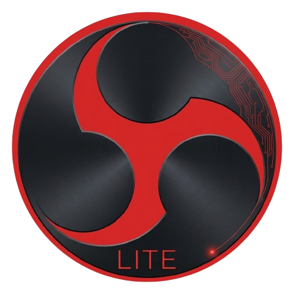

<p align="center">
  
</p>

<h1 align="center">OBS Lite AMD Edition</h1>

<p align="center">
  <strong>Stripped-down, AMD-optimized OBS for streaming and recording with minimal resource usage.</strong>
</p>

<p align="center">
  <a href="https://github.com/georgekgr12/GK_OBS_LITE_AMD/releases">Releases</a> &bull;
  <a href="#features">Features</a> &bull;
  <a href="#building">Building</a> &bull;
  <a href="#whats-removed">What's Removed</a>
</p>

---

## What is this?

OBS Lite AMD Edition is a **lightweight fork of [OBS Studio](https://obsproject.com) 31.0.3**, built exclusively for **AMD hardware on Windows**. It strips out everything you don't need (NVIDIA encoders, Intel QSV, macOS/Linux code, the browser plugin, scripting) and optimizes what's left for AMD Zen 3+ CPUs and RDNA GPUs.

The result: faster startup, lower RAM usage, smaller binary, and AMD hardware encoding (AMF) as a first-class citizen instead of an afterthought.

## Features

- **AMD-first encoder defaults** -- AMF HEVC is the default encoder. Dropdown order: AMD AV1 > AMD HEVC > AMD H.264 > x264 (fallback)
- **11 plugins** instead of 36 -- only what you actually need for streaming and recording
- **AVX2 + AMD64 compiler optimizations** -- built specifically for Zen 3+ processors
- **D3D11-only rendering** -- the sole graphics backend, matching AMD's best-optimized driver path on Windows
- **Portable by default** -- settings, scenes, and profiles live next to the executable. No installation required
- **Close-to-tray** -- clicking X minimizes to system tray (like Steam/AMD Adrenalin). Streaming, recording, and replay buffer keep running in the background
- **Tray quick controls** -- right-click the tray icon for Start/Stop Stream, Record, Replay Buffer, Save Replay, and Exit
- **No bloat** -- no Chromium browser source (~200MB RAM saved), no scripting runtime, no WebSocket server, no VLC dependency

## Target Hardware

| Component | Tested On |
|-----------|-----------|
| **CPU** | AMD Ryzen 7 5700X3D (Zen 3, 8C/16T) |
| **GPU** | AMD Radeon RX 9070 XT (RDNA 4) |
| **RAM** | 32GB DDR4 |
| **OS** | Windows 11 Pro |

Any AMD system with a Zen 2+ CPU and RDNA/RDNA 2+ GPU should work. The AVX2 requirement means no pre-Zen CPUs.

## What's Removed

### Non-AMD Encoders
- `obs-nvenc` -- NVIDIA GPU encoder
- `obs-qsv11` -- Intel Quick Sync Video
- `nv-filters` -- NVIDIA GPU filters

### Non-Windows Platform Code
- `libobs-opengl` -- OpenGL rendering (D3D11 is sole backend)
- All macOS plugins and Metal backend
- All Linux/BSD plugins and audio backends

### Heavyweight Optional Plugins
- `obs-browser` -- Chromium Embedded Framework (biggest RAM savings)
- `obs-websocket` -- remote control API
- `obs-webrtc` -- WebRTC output
- `vlc-video` -- VLC media source
- `decklink`, `aja` -- professional capture cards
- `obs-vst` -- VST audio plugins
- `text-freetype2` -- redundant text renderer
- `obs-libfdk` -- FDK AAC encoder
- Lua/Python scripting runtime

### What Remains (11 core plugins)

| Plugin | Purpose |
|--------|---------|
| `obs-ffmpeg` | FFmpeg muxing + **AMF hardware encoder** (H.264, HEVC, AV1) |
| `obs-x264` | Software H.264 fallback |
| `obs-filters` | Video/audio filters |
| `obs-transitions` | Scene transitions |
| `obs-outputs` | RTMP, SRT, RIST streaming + recording |
| `obs-text` | Windows text rendering |
| `image-source` | Image/slideshow sources |
| `rtmp-services` | Streaming service configs (Twitch, YouTube, etc.) |
| `win-capture` | Window, game, and monitor capture |
| `win-dshow` | Webcams and capture cards (DirectShow) |
| `win-wasapi` | Windows audio capture/output |

## Building

### Prerequisites
- Visual Studio 2022 (Community or BuildTools) with **Desktop development with C++** workload
- CMake 3.28+
- Git

### Quick Build
```cmd
git clone https://github.com/georgekgr12/GK_OBS_LITE_AMD.git
cd GK_OBS_LITE_AMD
cmake --preset amd-lite-x64
cmake --build build_amd_lite --config RelWithDebInfo --parallel
```

Or just run `build.bat` which handles everything including the Inno Setup installer.

### Build Output
The portable app will be at `build_amd_lite/rundir/RelWithDebInfo/`. Run `bin/64bit/obs64.exe` from there.

## How It Works

All changes are gated behind the `OBS_AMD_LITE` CMake flag and `#ifdef OBS_AMD_LITE` preprocessor guards. Building without the flag produces stock OBS Studio. This means:

- You can always diff against upstream OBS
- Cherry-picking upstream updates is straightforward
- The stock build path is never broken

## Credits

- [OBS Studio](https://obsproject.com) by the OBS Project -- the foundation this is built on
- [AMD AMF SDK](https://github.com/GPUOpen-LibrariesAndSDKs/AMF) -- hardware encoding framework

## License

Same as OBS Studio -- [GNU General Public License v2.0](COPYING).
